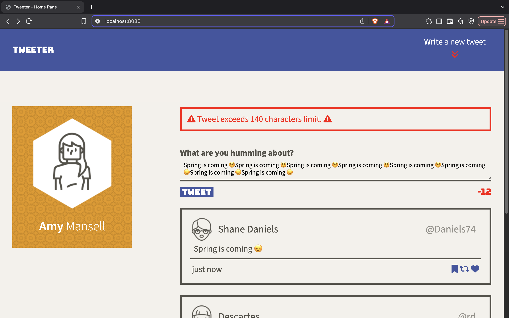
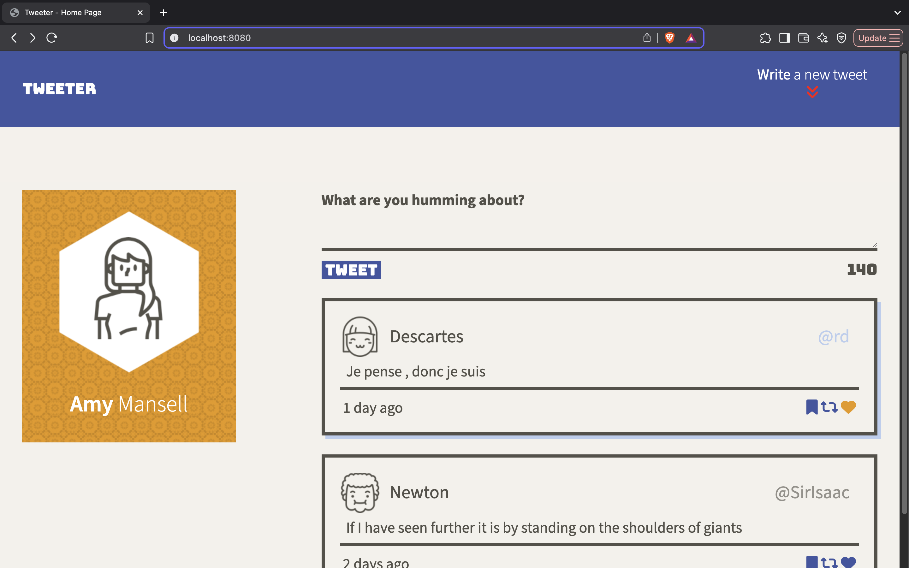
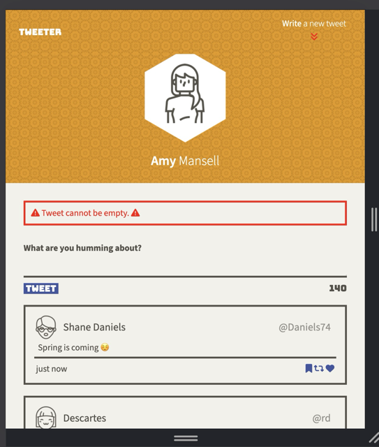

# Tweeter Project

Tweeter is a simple, single-page Twitter clone.

It allows users to compose and post short tweets (up to 140 characters) that are dynamically added to the main page without refreshing.
The newest tweets appear at the top of the feed. Tweeter is built using HTML, CSS, jQuery, and communicates asynchronously with a pre-built server.

## Features
- Compose and post new tweets in real time
- Smooth slide animation when composing a tweet
- Live character counter while typing
- Error messages for invalid submissions
- Tweets sorted with newest first
- Friendly hover effects on tweets and icons
- Mobile-friendly, responsive design
- Sticky navigation bar for easy access anywhere on the page

## Screenshots

### Character Limit Error (desktop)

### Hover Effect over a Tweet (desktop)

### Empty Tweet Error (mobile)

### Writing a New Tweet (mobile)

## Functionality
- Form submits new tweets via jQuery AJAX
- Form validation with animated error messages
- Character counter updates dynamically
- Compose button toggles tweet form with smooth slide animation
- Text area auto-focuses when form slides down

## Securiry
Tweeter ensures that all user-generated content is safely escaped before being added to the page, protecting users from cross-site scripting (XSS) attacks.
This means users can safely post any text they want, even special HTML characters, without breaking the site or risking security.

## Getting Started

1. [Create](https://docs.github.com/en/repositories/creating-and-managing-repositories/creating-a-repository-from-a-template) a new repository using this repository as a template.
2. Clone your repository onto your local device.
3. Install dependencies using the `npm install` command.
3. Start the web server using the `npm run local` command. The app will be served at <http://localhost:8080/>.
4. Go to <http://localhost:8080/> in your browser.

## Dependencies

- Express
- Body-parser
- Chance
- Node 5.10.x or above
